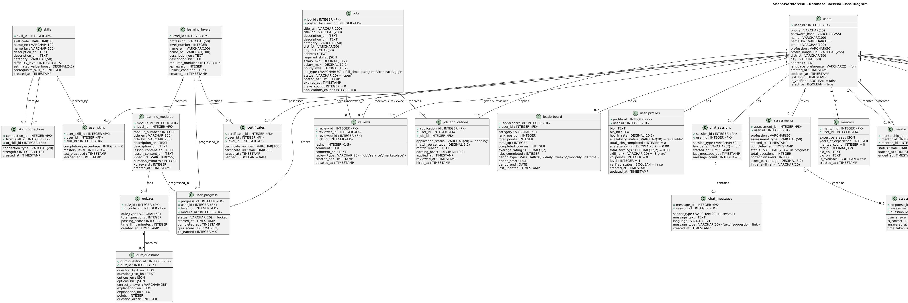
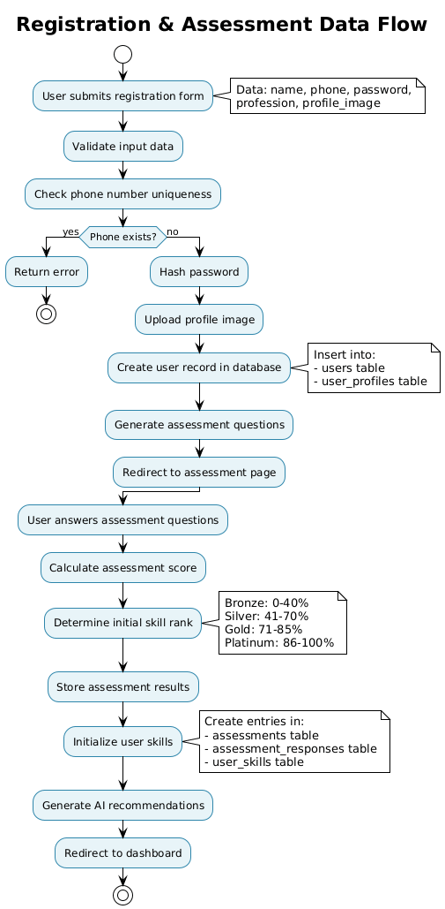
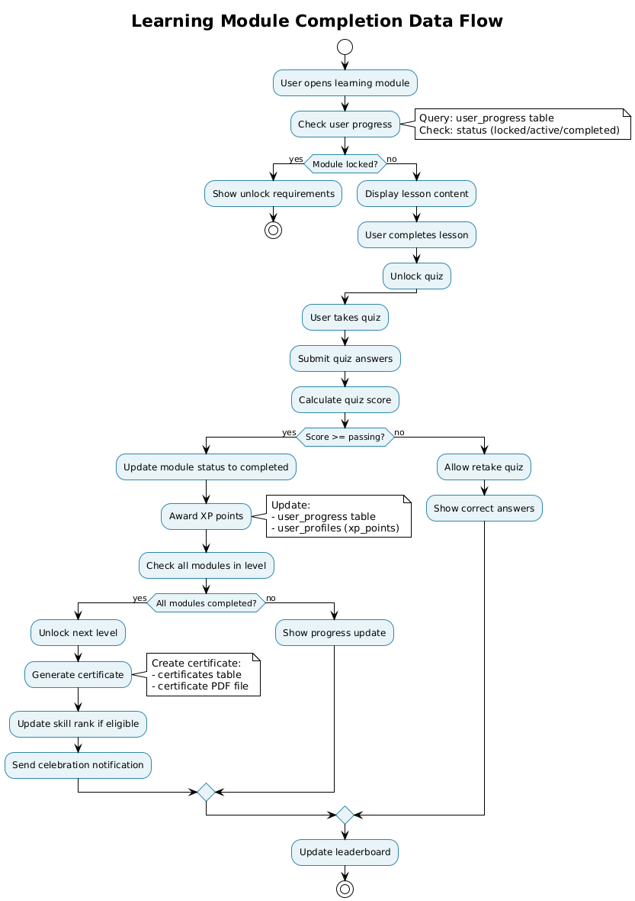
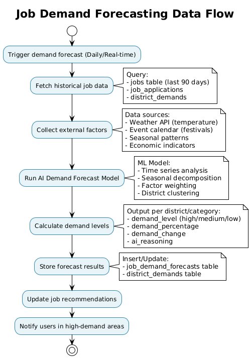
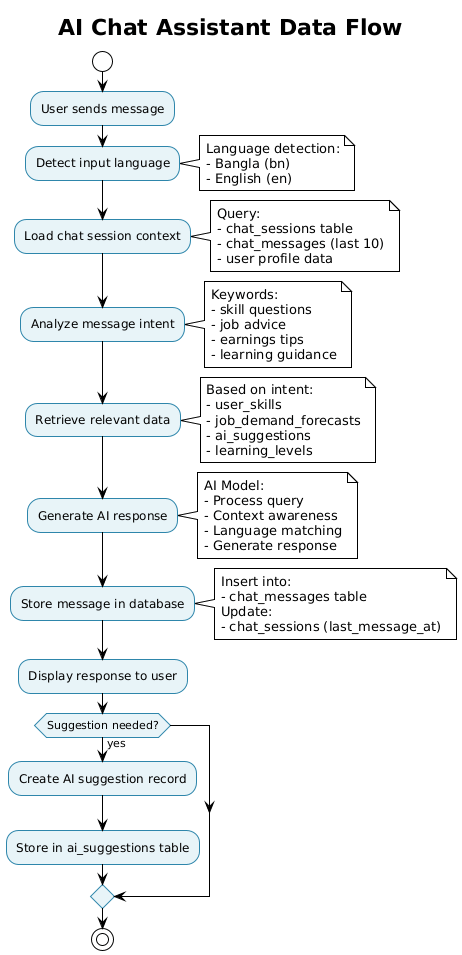
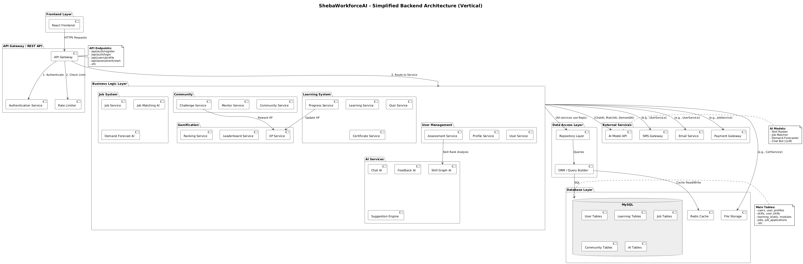

# ShebaWorkforceAI - Technical Documentation

**Startup Project Idea & Implementation Workflow**  
**AI-Powered Workforce Ecosystem for Bangladesh's Informal Workers**

> **Note**: This is a startup project idea with a working frontend prototype and comprehensive backend architecture design. The documentation describes both the implemented frontend and the proposed backend implementation workflow.

---

## 📋 Table of Contents

1. [Project Overview](#project-overview)
2. [Architecture](#architecture)
3. [Technology Stack](#technology-stack)
4. [Frontend Architecture](#frontend-architecture)
5. [Backend/Data Layer Architecture](#backenddata-layer-architecture)
6. [MySQL Database Workflow](#mysql-database-workflow)
7. [Backend Architecture with AI Integration](#backend-architecture-with-ai-integration)
8. [Feature Documentation](#feature-documentation)
9. [Data Flow & State Management](#data-flow--state-management)
10. [Component Structure](#component-structure)
11. [Installation & Setup](#installation--setup)
12. [Technical Implementation Details](#technical-implementation-details)


---

## 🎯 Project Overview {#project-overview}

**ShebaWorkforceAI** is a startup project idea and implementation workflow designed to empower Bangladesh's informal workforce (electricians, plumbers, mechanics, carpenters, painters) through AI-powered skill development, job matching, and career growth tools. This prototype demonstrates a complete ecosystem concept from learning to job discovery, with bilingual support (Bangla & English) and gamified learning experiences.

**Project Type**: Startup Idea / Prototype / Implementation Workflow  
**Status**: Concept Demonstration & Technical Implementation Guide

### ⚠️ Current Implementation Status

**Important Note**: This project currently uses **demo data** to interpret and demonstrate the main scenario and user workflows. The frontend prototype is fully functional and showcases all features using mock data stored in JSON files.

**Future Development**: With time, we will implement all backend services and AI features perfectly, transitioning from demo data to a fully functional production system with:
- Real database integration (MySQL/PostgreSQL)
- Server-side AI models and processing
- RESTful API endpoints
- Authentication and authorization
- Real-time data processing
- Production-grade security and scalability

The current demo data allows stakeholders and developers to visualize the complete user journey and understand the proposed system architecture before full implementation.

### Project Status Overview

| Component | Status | Description |
|-----------|--------|-------------|
| **Frontend Prototype** | ✅ **Implemented** | Fully functional React application with all UI/UX features (uses demo data) |
| **Backend Architecture** | 📋 **Designed** | Complete architecture design and API specification |
| **Database Schema** | 📋 **Designed** | Comprehensive MySQL/PostgreSQL schema with all tables |
| **AI Workflows** | 📋 **Documented** | Detailed AI integration workflows and algorithms |
| **API Endpoints** | 📋 **Specified** | Complete REST API endpoint documentation |
| **Deployment Config** | 📋 **Prepared** | Server configurations for various deployment options |
| **Data Source** | ⚠️ **Demo Data** | Currently using JSON files; will transition to real database |

**Legend**: ✅ Implemented | 📋 Designed/Documented | 🚧 In Progress

### Key Objectives
- **Skill Development**: Gamified micro-learning system with progress tracking
- **Job Matching**: AI-powered job recommendations based on skills and location
- **Earnings Prediction**: Forecast income growth based on skill acquisition
- **Community Building**: Connect workers with mentors and peers
- **Market Intelligence**: District-wise job demand visualization

---

## 🏗️ Architecture {#architecture}

### System Architecture Overview

```
┌─────────────────────────────────────────────────────────────┐
│                        Frontend Layer                       │
│  React + Vite + TailwindCSS + React Router                  │
│  ┌──────────────┐  ┌──────────────┐  ┌──────────────┐       │
│  │  Components  │  │   Context    │  │    Utils     │       │
│  │   (UI/UX)    │  │  (Language)  │  │  (Helpers)   │       │
│  └──────────────┘  └──────────────┘  └──────────────┘       │
└─────────────────────────────────────────────────────────────┘
                            │
                            │ HTTPS REST API
                            ▼
┌─────────────────────────────────────────────────────────────┐
│                    API Gateway Layer                        │
│  ┌──────────────┐  ┌──────────────┐  ┌──────────────┐       │
│  │ Auth Service │  │ Rate Limiter │  │ Load Balancer│       │
│  └──────────────┘  └──────────────┘  └──────────────┘       │
└─────────────────────────────────────────────────────────────┘
                            │
                            │
                            ▼
┌─────────────────────────────────────────────────────────────┐
│                  Business Logic Layer                       │
│  ┌──────────────┐  ┌──────────────┐  ┌──────────────┐       │
│  │ User Service │  │ Learning Svc │  │  Job Service │       │
│  └──────────────┘  └──────────────┘  └──────────────┘       │
│  ┌──────────────┐  ┌──────────────┐  ┌──────────────┐       │
│  │  AI Services │  │ Community Svc│  │ Gamification │       │
│  └──────────────┘  └──────────────┘  └──────────────┘       │
└─────────────────────────────────────────────────────────────┘
                            │
                            │
                            ▼
┌─────────────────────────────────────────────────────────────┐
│                    Data Access Layer                        │
│  ┌──────────────┐  ┌──────────────┐  ┌──────────────┐       │
│  │ Repository   │  │   ORM/Query  │  │   Cache      │       │
│  │   Layer      │  │   Builder    │  │   Manager    │       │
│  └──────────────┘  └──────────────┘  └──────────────┘       │
└─────────────────────────────────────────────────────────────┘
                            │
                            │
                            ▼
┌─────────────────────────────────────────────────────────────┐
│                    Database Layer                           │
│  ┌──────────────┐  ┌──────────────┐  ┌──────────────┐       │
│  │              │  │    Redis     │  │ File Storage │       │
│  │     MySQL    │  │    Cache     │  │   (S3/CDN)   │       │
│  └──────────────┘  └──────────────┘  └──────────────┘       │
└─────────────────────────────────────────────────────────────┘
```

### Architecture Type
- **Frontend**: Single Page Application (SPA) using React (Implemented)
- **Backend**: Proposed RESTful API server with Node.js/Express or Python/FastAPI (Architecture Defined)
- **Database**: Proposed PostgreSQL/MySQL schema for primary data storage (Schema Designed)
- **Cache**: Proposed Redis for performance optimization (Architecture Planned)
- **AI Integration**: Proposed server-side AI models and services (Workflow Documented)
- **State Management**: React Context API + Proposed Server State
- **Routing**: Client-side routing with React Router v6 (Implemented)

**Note**: This document describes both the implemented frontend prototype and the proposed backend architecture for the startup idea.

---

## 💻 Technology Stack {#technology-stack}

### Frontend Technologies

| Technology | Version | Purpose |
|------------|---------|---------|
| **React** | ^18.2.0 | UI library for component-based architecture |
| **Vite** | ^5.0.8 | Build tool and development server |
| **React Router DOM** | ^6.20.0 | Client-side routing and navigation |
| **TailwindCSS** | ^3.3.6 | Utility-first CSS framework |
| **Recharts** | ^2.10.3 | Chart library for data visualization |

### Development Tools

| Tool | Purpose |
|------|---------|
| **PostCSS** | CSS processing |
| **Autoprefixer** | CSS vendor prefixing |
| **TypeScript Types** | Type definitions for React |

### Backend Technologies

| Technology | Purpose |
|------------|---------|
| **Node.js/Express** or **Python/FastAPI** | RESTful API server |
| **PostgreSQL/MySQL** | Primary relational database |
| **Redis** | Caching and session management |
| **JWT** | Authentication and authorization |
| **AI/ML Models** | Skill assessment, job matching, demand forecasting |
| **Docker** | Containerization |
| **AWS/GCP** | Cloud deployment and services |

### Data & Storage

| Technology | Purpose |
|------------|---------|
| **PostgreSQL/MySQL** | Primary database for all application data |
| **Redis** | Caching layer for performance optimization |
| **S3/Cloud Storage** | File storage for images, certificates, documents |
| **React Context** | Global state management (language, user session) |

---

## 🎨 Frontend Architecture {#frontend-architecture}

### Component Hierarchy

```
App.jsx
├── LanguageProvider (Context)
├── Router
│   ├── Navbar (Global Navigation)
│   ├── Routes
│   │   ├── LandingPage
│   │   ├── Register
│   │   ├── Assessment
│   │   ├── Dashboard
│   │   │   ├── SkillGraph
│   │   │   ├── EarningsCard
│   │   │   ├── ProgressCard
│   │   │   └── NextSkills
│   │   ├── LearningMap
│   │   │   ├── LevelNode
│   │   │   ├── ModulePanel
│   │   │   ├── ModuleModal
│   │   │   └── CertificateModal
│   │   ├── JobDemandMap
│   │   ├── JobMatching
│   │   ├── Leaderboard
│   │   ├── Assistant
│   │   ├── Marketplace
│   │   ├── Community
│   │   └── Insights
│   └── FloatingChatBox (Global)
```

### Key Frontend Patterns

1. **Component-Based Architecture**: Modular, reusable components
2. **Context API**: Global state for language and user preferences
3. **Custom Hooks**: Language detection, storage utilities
4. **Conditional Rendering**: Based on user state and progress
5. **Responsive Design**: Mobile-first approach with TailwindCSS

---

## 🗄️ Backend/Data Layer Architecture {#backenddata-layer-architecture}

### Current Implementation: Demo Data

**Current Status**: The frontend prototype currently uses **demo data stored in JSON files** (`/public/*.json`) to interpret and demonstrate the main scenario. This allows the complete user journey to be visualized and tested without requiring backend implementation.

**Demo Data Files**:
- `assessmentData.json` - Assessment questions and results
- `learningData.json` - Learning levels and modules
- `quizData.json` - Quiz questions
- `jobDemandData.json` - District-wise job demand
- `jobMatchingData.json` - Job listings
- `leaderboardData.json` - Leaderboard rankings
- `assistantData.json` - AI assistant responses
- `marketplaceData.json` - Technician profiles
- `communityData.json` - Community data
- `feedbackData.json` - Feedback and insights

**Future Implementation**: With time, we will implement all backend and AI features perfectly, replacing demo data with real database queries and AI-powered processing.

### Proposed Data Storage Strategy

This section documents the **proposed server-side architecture** for future implementation. The startup project design includes:

1. **RESTful API Server**: Proposed to handle all business logic and data processing
2. **PostgreSQL/MySQL Database**: Proposed schema designed to store all persistent data
3. **Redis Cache**: Proposed for optimizing frequently accessed data
4. **AI Services**: Proposed server-side AI models for intelligent features
5. **File Storage**: Proposed cloud storage for images, certificates, documents

**Current Status**: Architecture designed and documented. Implementation pending.

### Proposed Backend API Structure

The following structure is proposed for future backend implementation:

```
Backend/ (Proposed)
├── controllers/          # Request handlers
├── services/            # Business logic
│   ├── userService.js
│   ├── learningService.js
│   ├── jobService.js
│   ├── aiService.js
│   └── communityService.js
├── models/              # Database models
├── routes/              # API routes
├── middleware/          # Auth, validation, etc.
├── utils/              # Helper functions
└── ai/                  # AI model integration
    ├── skillRanker.js
    ├── jobMatcher.js
    ├── demandForecaster.js
    └── chatAI.js
```

**Status**: Architecture designed, implementation pending.

### Proposed Data Flow Pattern

The following data flow is proposed for backend implementation:

```
User Action → Frontend Component → REST API Request → API Gateway
                │
                ▼
        Authentication & Authorization
                │
                ▼
        Business Logic Service
                │
                ▼
        Data Access Layer (Repository/ORM)
                │
                ▼
        Database Query (PostgreSQL/MySQL)
                │
                ▼
        Cache Update (Redis)
                │
                ▼
        AI Processing (if needed)
                │
                ▼
        Response → Frontend → Update UI
```

**Current Status**: Frontend prototype uses mock data. Backend implementation will follow this pattern.

### Proposed API Endpoints Structure

The following API endpoints are designed for future implementation:

| Endpoint | Method | Purpose | Status |
|----------|--------|---------|--------|
| `/api/auth/register` | POST | User registration | 📋 Designed |
| `/api/auth/login` | POST | User authentication | 📋 Designed |
| `/api/users/profile` | GET/PUT | User profile management | 📋 Designed |
| `/api/assessment/start` | POST | Start skill assessment | 📋 Designed |
| `/api/assessment/submit` | POST | Submit assessment answers | 📋 Designed |
| `/api/learning/levels` | GET | Get learning levels | 📋 Designed |
| `/api/learning/progress` | GET/PUT | Learning progress tracking | 📋 Designed |
| `/api/jobs/match` | POST | AI-powered job matching | 📋 Designed |
| `/api/jobs/apply` | POST | Submit job application | 📋 Designed |
| `/api/demand/forecast` | GET | Get demand forecasts | 📋 Designed |
| `/api/ai/chat` | POST | AI chat assistant | 📋 Designed |
| `/api/community/groups` | GET | Get community groups | 📋 Designed |
| `/api/insights` | GET | Get user insights | 📋 Designed |

**Legend**: ✅ Implemented | 📋 Designed | 🚧 In Progress

---

## 📚 Feature Documentation {#feature-documentation}

> **Note**: Each feature section describes both the **implemented frontend prototype** (✅) and the **proposed backend implementation** (📋). The frontend is fully functional with mock data, while the backend architecture is designed and documented for future implementation.

### 1. User Registration & Assessment

**Route**: `/register` → `/assessment`

#### Frontend Implementation

**Components**: `Register.jsx`, `Assessment.jsx`

**How It Works**:

1. **Registration Flow**:
   - User fills form: name, phone, password, profession, profile image
   - Frontend sends POST request to `/api/auth/register`
   - Backend validates input, checks phone uniqueness
   - Password hashed using bcrypt
   - Profile image uploaded to cloud storage (S3/CDN)
   - User record created in `users` table
   - User profile initialized in `user_profiles` table
   - JWT token generated and returned
   - Frontend stores token and redirects to `/assessment`

2. **Assessment Flow**:
   - Frontend requests assessment questions via `GET /api/assessment/start`
   - Backend queries `assessment_questions` table filtered by profession
   - Questions returned with bilingual support
   - User answers tracked in frontend state
   - 30-minute timer with auto-submit
   - On submit: Frontend sends POST to `/api/assessment/submit`
   - Backend AI Service processes answers:
     - Calculates score: `(correctAnswers / totalQuestions) * 100`
     - Determines rank using AI classification model:
       - 0-40%: Bronze
       - 41-60%: Silver
       - 61-80%: Gold
       - 81-100%: Platinum
   - Results stored in `assessments` and `assessment_responses` tables
   - `user_profiles.skill_rank` updated
   - Initial `user_skills` entries created
   - AI generates personalized recommendations
   - Response returned to frontend, redirects to `/dashboard`

#### Backend Implementation

**API Endpoints**:
- `POST /api/auth/register` - User registration
- `GET /api/assessment/start` - Get assessment questions
- `POST /api/assessment/submit` - Submit assessment answers

**Database Tables**:
- `users` - User account information
- `user_profiles` - Extended user profile data
- `assessment_questions` - Question bank by profession
- `assessments` - Assessment sessions
- `assessment_responses` - Individual question responses
- `user_skills` - User skill tracking

**AI Processing**:
- **Skill Ranker AI Model**: Classification model that analyzes answer patterns
- **Recommendation Engine**: Generates personalized learning paths based on rank and profession
- **Score Calculation**: Server-side validation and scoring

---

### 2. Dashboard & Skill Graph

**Route**: `/dashboard`

#### Frontend Implementation

**Components**: `Dashboard.jsx`, `SkillGraph.jsx`, `EarningsCard.jsx`, `ProgressCard.jsx`, `NextSkills.jsx`

**How It Works**:

1. **Data Loading**:
   - Frontend requests user data via `GET /api/users/profile`
   - Backend validates JWT token and fetches user from `users` and `user_profiles` tables
   - Frontend requests learning levels via `GET /api/learning/levels?profession={profession}`
   - Backend queries `learning_levels` table filtered by profession
   - Frontend requests progress via `GET /api/learning/progress`
   - Backend queries `user_progress` table for user's completion status
   - All data returned as JSON response

2. **Skill Graph Visualization**:
   - Frontend requests skill graph via `GET /api/skills/graph`
   - Backend queries `user_skills` and `skills` tables
   - Calculates skill completion percentages from `user_progress`
   - Retrieves skill connections from `skill_connections` table
   - Returns skill nodes with completion data and connections
   - Frontend renders interactive SVG graph

3. **Earnings Calculation**:
   - Backend AI Service calculates earnings prediction:
     - Base earnings by profession from `user_profiles`
     - Skill boost calculated from completed skills in `user_skills`
     - Formula: `baseEarning + Σ(skill.completion * skill.value_boost)`
     - Next month prediction using ML model based on progress rate
   - Results returned via `GET /api/users/earnings-prediction`

4. **Progress Tracking**:
   - Backend aggregates data from `user_progress` table
   - Calculates total/completed levels and modules
   - Updates rank in `user_profiles.skill_rank` based on completion rate
   - Returns statistics via `GET /api/learning/stats`

5. **AI Workflow Creation**:
   - User clicks "Create Upskill Workflow"
   - Frontend sends POST to `/api/ai/workflow/create`
   - Backend AI Service analyzes:
     - User's current skills from `user_skills`
     - Learning progress from `user_progress`
     - Skill connections from `skill_connections`
     - Market demand from `job_demand_forecasts`
   - AI generates personalized course recommendations
   - Results stored in `ai_suggestions` table
   - Recommendations returned to frontend

#### Backend Implementation

**API Endpoints**:
- `GET /api/users/profile` - Get user profile
- `GET /api/learning/levels` - Get learning levels
- `GET /api/learning/progress` - Get user progress
- `GET /api/skills/graph` - Get skill graph data
- `GET /api/users/earnings-prediction` - Get earnings prediction
- `GET /api/learning/stats` - Get learning statistics
- `POST /api/ai/workflow/create` - Generate AI workflow

**Database Tables**:
- `learning_levels` - Learning level definitions
- `learning_modules` - Module content
- `user_progress` - User learning progress
- `skills` - Skill definitions
- `user_skills` - User skill tracking
- `skill_connections` - Skill prerequisite relationships
- `ai_suggestions` - AI-generated recommendations

---

## 🗄️ MySQL Database Workflow {#mysql-database-workflow}

### Database Schema Overview

This section documents the **proposed database architecture** for the ShebaWorkforceAI startup project. The comprehensive MySQL/PostgreSQL database schema is designed to support all features of the platform. The database is structured into logical modules that handle user management, learning, jobs, community, and AI services.

**Status**: Database schema designed and documented as part of the implementation workflow.



### Core Database Modules

#### 1. User Management Module

**Tables**: `users`, `user_profiles`

**Purpose**: Manages user accounts, authentication, and profile information.

**Key Relationships**:
- One user can have one profile (`users` 1:1 `user_profiles`)
- Users linked to all other modules via `user_id` foreign keys

**Workflow**:
```
User Registration → users table → user_profiles table → Initialize default values
```

**Key Fields**:
- `users`: phone (unique), password_hash, profession, district, language_preference
- `user_profiles`: skill_rank, xp_points, total_earnings, average_rating

#### 2. Skill & Assessment System

**Tables**: `skills`, `user_skills`, `skill_connections`, `assessments`, `assessment_questions`, `assessment_responses`

**Purpose**: Tracks skills, skill relationships, and initial user assessment.

**Workflow**:
```
Assessment Start → assessment_questions → User Answers → assessment_responses 
→ Calculate Score → assessments table → Update user_skills → Update user_profiles.skill_rank
```

**Key Features**:
- Skill graph structure via `skill_connections` (prerequisite relationships)
- Assessment scoring and rank assignment (Bronze → Silver → Gold → Platinum)
- User skill mastery tracking

#### 3. Learning & Gamification Module

**Tables**: `learning_levels`, `learning_modules`, `quizzes`, `quiz_questions`, `user_progress`, `certificates`

**Purpose**: Manages the gamified learning system with levels, modules, quizzes, and certificates.

**Workflow**:
```
User Opens Module → Check user_progress.status → Display Content → Quiz Completion 
→ Update user_progress → Award XP → Check Level Completion → Generate Certificate
```

**Key Relationships**:
- `learning_levels` 1:N `learning_modules`
- `learning_modules` 1:1 `quizzes`
- `quizzes` 1:N `quiz_questions`
- `user_progress` tracks completion per user/level/module

**Progress States**:
- `locked`: Module not yet unlocked
- `active`: Module in progress
- `completed`: Module finished

#### 4. Job & Demand System

**Tables**: `jobs`, `job_applications`, `job_demand_forecasts`, `district_demands`

**Purpose**: Manages job postings, applications, and AI-powered demand forecasting.

**Workflow**:
```
Job Posting → jobs table → AI Matching Algorithm → job_applications 
→ Match Score Calculation → Display to User → Application Submission
```

**Demand Forecasting Workflow**:
```
Daily Trigger → Fetch Historical Data → External Factors (Weather, Events) 
→ AI Model Analysis → job_demand_forecasts → district_demands → Update Recommendations
```

**Key Features**:
- AI-powered job matching based on skills, location, rating
- Real-time demand forecasting per district/category
- Application tracking and status management

#### 5. Rating & Review System

**Tables**: `reviews`

**Purpose**: Manages ratings and reviews for jobs, services, and marketplace interactions.

**Workflow**:
```
Job Completion → Create Review → reviews table → Update user_profiles.average_rating 
→ Update leaderboard → Update marketplace ratings
```

#### 6. Leaderboard & Ranking

**Tables**: `leaderboard`

**Purpose**: Tracks user rankings across different categories and time periods.

**Workflow**:
```
User Activity → Update Metrics → Calculate Points → leaderboard table 
→ Rank Calculation → Display Rankings
```

**Period Types**:
- `daily`: Daily rankings
- `weekly`: Weekly rankings
- `monthly`: Monthly rankings
- `all_time`: Lifetime rankings

#### 7. Community & Mentorship

**Tables**: `community_groups`, `group_members`, `group_posts`, `mentors`, `mentor_mentee`, `challenges`, `challenge_participants`

**Purpose**: Manages community groups, mentorship programs, and skill challenges.

**Workflow**:
```
User Joins Group → group_members → Create Post → group_posts 
→ Request Mentorship → mentor_mentee → Join Challenge → challenge_participants
```

#### 8. AI Assistant & Chat

**Tables**: `chat_sessions`, `chat_messages`, `ai_suggestions`

**Purpose**: Manages AI chat sessions, message history, and AI-generated suggestions.

**Workflow**:
```
User Message → Language Detection → Load Context → AI Processing 
→ Generate Response → chat_messages → Create Suggestions → ai_suggestions
```

#### 9. Feedback & Insights

**Tables**: `user_insights`, `feedback_logs`

**Purpose**: Tracks AI-generated insights and feedback for continuous learning.

**Workflow**:
```
User Activity → Analyze Progress → AI Feedback Generation → user_insights 
→ feedback_logs → Update Recommendations
```

#### 10. Notifications

**Tables**: `notifications`

**Purpose**: Manages user notifications for various events.

**Workflow**:
```
Event Trigger → Create Notification → notifications table → Push to User 
→ Mark as Read
```

### Database Relationships Summary

```
users (1) ──→ (1) user_profiles
users (1) ──→ (N) user_skills ──→ (N) skills
users (1) ──→ (N) assessments ──→ (N) assessment_responses
users (1) ──→ (N) user_progress ──→ (N) learning_levels
users (1) ──→ (N) job_applications ──→ (N) jobs
users (1) ──→ (N) leaderboard
users (1) ──→ (N) chat_sessions ──→ (N) chat_messages
users (1) ──→ (N) user_insights
```

### Key Database Workflows

#### Registration & Assessment Flow



**Process**:
1. User submits registration form
2. Validate and check phone uniqueness
3. Hash password and upload profile image
4. Create user record in `users` table
5. Initialize `user_profiles` with default values
6. Generate assessment questions from `assessment_questions`
7. User completes assessment
8. Calculate score and determine initial rank
9. Store results in `assessments` and `assessment_responses`
10. Initialize `user_skills` based on assessment results
11. Generate AI recommendations
12. Redirect to dashboard

#### Learning Module Flow



**Process**:
1. User opens learning module
2. Check `user_progress.status` (locked/active/completed)
3. If locked, show unlock requirements
4. Display lesson content from `learning_modules`
5. User completes lesson
6. Unlock quiz from `quizzes` and `quiz_questions`
7. User takes quiz and submits answers
8. Calculate quiz score
9. If passing (≥70%):
   - Update `user_progress.status` to 'completed'
   - Award XP points (update `user_profiles.xp_points`)
   - Check if all modules in level are completed
   - If yes: Unlock next level, generate certificate, update skill rank
10. If failing: Allow retake
11. Update leaderboard rankings

#### Job Matching Flow


**Process**:
1. User navigates to job matching
2. Load user profile, skills, certificates, ratings
3. Fetch available jobs (status='open')
4. Initialize Job Matching AI
5. For each job, calculate match score:
   - Skill overlap (40%)
   - Location proximity (20%)
   - Rating/reputation (20%)
   - Experience level (10%)
   - Certificate count (10%)
6. Calculate earning boost prediction
7. Generate match reasoning
8. Sort jobs by match percentage
9. Display matched jobs
10. User applies → Create `job_applications` record
11. Notify job poster
12. Update job application count

#### Demand Forecast Flow



**Process**:
1. Daily/Real-time trigger for demand forecast
2. Fetch historical job data (last 90 days)
3. Collect external factors:
   - Weather API (temperature)
   - Event calendar (festivals)
   - Seasonal patterns
   - Economic indicators
4. Run AI Demand Forecast Model:
   - Time series analysis
   - Seasonal decomposition
   - Factor weighting
   - District clustering
5. Calculate demand levels per district/category:
   - `demand_level`: high/medium/low
   - `demand_percentage`: 0-100%
   - `demand_change`: percentage change
   - `ai_reasoning`: explanation
6. Store in `job_demand_forecasts` and `district_demands`
7. Update job recommendations
8. Notify users in high-demand areas

#### Chat AI Flow



**Process**:
1. User sends message
2. Detect input language (Bangla/English)
3. Load chat session context:
   - Previous messages (last 10)
   - User profile data
   - User skills and progress
4. Analyze message intent:
   - Skill questions
   - Job advice
   - Earnings tips
   - Learning guidance
5. Retrieve relevant data based on intent
6. Generate AI response:
   - Process query with context
   - Language matching
   - Generate personalized response
7. Store message in `chat_messages`
8. Update `chat_sessions.last_message_at`
9. Display response to user
10. If suggestion needed, create `ai_suggestions` record

### Database Indexes

**Performance Optimization**:

```sql
-- User lookups
CREATE INDEX idx_users_phone ON users(phone);
CREATE INDEX idx_users_email ON users(email);
CREATE INDEX idx_users_district ON users(district);

-- Skill queries
CREATE INDEX idx_user_skills_user_skill ON user_skills(user_id, skill_id);
CREATE INDEX idx_skills_category ON skills(category);

-- Learning progress
CREATE INDEX idx_user_progress_user_level ON user_progress(user_id, level_id);
CREATE INDEX idx_learning_levels_profession ON learning_levels(profession, level_number);

-- Job matching
CREATE INDEX idx_jobs_status_district ON jobs(status, district);
CREATE INDEX idx_job_applications_user_status ON job_applications(user_id, application_status);
CREATE INDEX idx_job_demand_forecasts_district ON job_demand_forecasts(district, category, forecast_date);

-- Leaderboard
CREATE INDEX idx_leaderboard_category_period ON leaderboard(category, period_type, rank_position);

-- Chat
CREATE INDEX idx_chat_sessions_user ON chat_sessions(user_id, last_message_at);
CREATE INDEX idx_chat_messages_session ON chat_messages(session_id, created_at);

-- Notifications
CREATE INDEX idx_notifications_user_read ON notifications(user_id, is_read, created_at);
```

### Database Transactions

**Critical Transactions**:

1. **User Registration**:
   ```sql
   BEGIN TRANSACTION;
   INSERT INTO users (...);
   INSERT INTO user_profiles (...);
   COMMIT;
   ```

2. **Module Completion**:
   ```sql
   BEGIN TRANSACTION;
   UPDATE user_progress SET status='completed', completed_at=NOW();
   UPDATE user_profiles SET xp_points=xp_points+100;
   -- Check level completion
   IF all_modules_completed THEN
     INSERT INTO certificates (...);
     UPDATE user_progress SET status='unlocked' WHERE level_id=next_level;
   END IF;
   COMMIT;
   ```

3. **Job Application**:
   ```sql
   BEGIN TRANSACTION;
   INSERT INTO job_applications (...);
   UPDATE jobs SET applications_count=applications_count+1;
   INSERT INTO notifications (...);
   COMMIT;
   ```

---

## 🤖 Backend Architecture with AI Integration {#backend-architecture-with-ai-integration}

### Proposed System Architecture Overview

This section documents the **proposed backend architecture** and AI integration workflow for the ShebaWorkforceAI startup project. The architecture is designed to support scalability and AI-powered features.



### Architecture Layers

#### 1. Frontend Layer
- **React Frontend**: User interface components
- **Language Context**: Bilingual state management
- **Local Storage**: Client-side caching

#### 2. API Gateway / REST API
- **API Gateway**: Request routing and load balancing
- **Authentication Service**: JWT token validation
- **Rate Limiter**: Request throttling and DDoS protection

**API Endpoints**:
```
POST   /api/auth/register          - User registration
POST   /api/auth/login             - User authentication
GET    /api/users/profile          - Get user profile
POST   /api/assessment/start       - Start assessment
GET    /api/learning/levels        - Get learning levels
POST   /api/jobs/match             - Get job matches
GET    /api/community/groups       - Get community groups
POST   /api/ai/chat                - AI chat interaction
```

#### 3. Business Logic Layer

**User Management Services**:
- `UserService`: User CRUD operations
- `ProfileService`: Profile management
- `AssessmentService`: Assessment processing

**Learning System Services**:
- `LearningService`: Learning content management
- `QuizService`: Quiz processing and scoring
- `ProgressService`: Progress tracking
- `CertificateService`: Certificate generation

**Job System Services**:
- `JobService`: Job CRUD operations
- `JobMatchingAI`: AI-powered job matching
- `DemandForecastAI`: Demand prediction

**Gamification Services**:
- `XPService`: XP point management
- `LeaderboardService`: Ranking calculations
- `RankingService`: Rank updates

**Community Services**:
- `CommunityService`: Group management
- `MentorService`: Mentorship programs
- `ChallengeService`: Challenge management

**AI Services**:
- `ChatAI`: Conversational AI assistant
- `SkillGraphAI`: Skill analysis and recommendations
- `FeedbackAI`: Progress insights generation
- `SuggestionEngine`: Personalized suggestions

#### 4. Data Access Layer
- **Repository Layer**: Data access abstraction
- **ORM/Query Builder**: Database query management

#### 5. Database Layer
- **PostgreSQL/MySQL**: Primary database
- **Redis Cache**: Caching layer for performance
- **File Storage**: Certificate and image storage

#### 6. External Services
- **SMS Gateway**: OTP verification
- **Email Service**: Notifications
- **Payment Gateway**: Payment processing
- **AI Model API**: Machine learning inference

### AI Integration Workflow

#### 1. Skill Assessment AI

**Model Type**: Classification Model

**Input**:
- Assessment answers
- User profession
- Time taken per question

**Process**:
```python
def assess_skill_level(answers, profession):
    # Feature extraction
    features = extract_features(answers)
    
    # Model inference
    skill_level = skill_ranker_model.predict(features)
    
    # Rank assignment
    rank = calculate_rank(skill_level)
    
    return {
        'rank': rank,
        'score': skill_level,
        'recommendations': generate_recommendations(rank, profession)
    }
```

**Output**:
- Skill rank (Bronze/Silver/Gold/Platinum)
- Initial skill recommendations
- Learning path suggestions

#### 2. Job Matching AI

**Model Type**: Recommendation System (Collaborative + Content-Based)

**Input**:
- User skills (`user_skills`)
- User location (`users.district`)
- User rating (`user_profiles.average_rating`)
- Job requirements (`jobs.required_skills`)
- Job location (`jobs.district`)

**Process**:
```python
def match_jobs(user_id, jobs):
    user_profile = get_user_profile(user_id)
    user_skills = get_user_skills(user_id)
    
    matches = []
    for job in jobs:
        # Skill overlap calculation
        skill_match = calculate_skill_overlap(
            user_skills, 
            job.required_skills
        )
        
        # Location proximity
        location_match = calculate_location_proximity(
            user_profile.district,
            job.district
        )
        
        # Rating factor
        rating_match = user_profile.average_rating / 5.0
        
        # ML model prediction
        match_score = job_matcher_model.predict([
            skill_match,
            location_match,
            rating_match,
            user_profile.xp_points,
            user_profile.total_jobs_completed
        ])
        
        matches.append({
            'job_id': job.id,
            'match_percentage': match_score * 100,
            'reasons': generate_match_reasons(...),
            'earning_boost': calculate_earning_boost(...)
        })
    
    return sorted(matches, key=lambda x: x['match_percentage'], reverse=True)
```

**Output**:
- Match percentage (0-100%)
- Match reasons (explainable AI)
- Earning boost prediction

#### 3. Demand Forecasting AI

**Model Type**: Time Series Analysis (LSTM/ARIMA)

**Input**:
- Historical job data (last 90 days)
- Weather data (temperature, season)
- Event calendar (festivals, holidays)
- Economic indicators

**Process**:
```python
def forecast_demand(district, category):
    # Historical data
    historical = get_historical_jobs(district, category, days=90)
    
    # External factors
    weather = get_weather_data(district)
    events = get_event_calendar(district)
    seasonal = get_seasonal_patterns(category)
    
    # Feature engineering
    features = prepare_features(
        historical,
        weather,
        events,
        seasonal
    )
    
    # Time series model prediction
    forecast = demand_forecast_model.predict(features)
    
    # Calculate demand level
    demand_level = classify_demand(forecast)
    
    # Generate AI reasoning
    reasoning = generate_reasoning(
        forecast,
        weather,
        events,
        seasonal
    )
    
    return {
        'district': district,
        'category': category,
        'demand_level': demand_level,
        'demand_percentage': forecast * 100,
        'demand_change': calculate_change(forecast),
        'ai_reasoning': reasoning,
        'factors': {
            'weather': weather.impact,
            'events': events.impact,
            'seasonal': seasonal.impact
        }
    }
```

**Output**:
- Demand level (high/medium/low)
- Demand percentage (0-100%)
- Demand change (percentage)
- AI reasoning (explainable predictions)
- Contributing factors

#### 4. Chat AI Assistant

**Model Type**: Large Language Model (LLM) / NLP

**Input**:
- User message
- Chat history (last 10 messages)
- User profile context
- User skills and progress

**Process**:
```python
def generate_chat_response(user_id, message):
    # Language detection
    language = detect_language(message)
    
    # Load context
    session = get_chat_session(user_id)
    history = get_recent_messages(session.id, limit=10)
    user_context = get_user_context(user_id)
    
    # Intent classification
    intent = classify_intent(message)
    
    # Retrieve relevant data
    relevant_data = retrieve_data(intent, user_context)
    
    # Generate response
    response = chat_ai_model.generate(
        message=message,
        context={
            'history': history,
            'user_profile': user_context,
            'relevant_data': relevant_data
        },
        language=language
    )
    
    # Store message
    store_message(session.id, 'user', message, language)
    store_message(session.id, 'ai', response, language)
    
    # Generate suggestions if needed
    if should_suggest(response):
        create_ai_suggestion(user_id, response)
    
    return response
```

**Output**:
- AI-generated response (same language as input)
- Context-aware suggestions
- Personalized recommendations

#### 5. Feedback & Insights AI

**Model Type**: Analytics & Recommendation Engine

**Input**:
- User progress data
- Learning history
- Skill completion rates
- Earnings history

**Process**:
```python
def generate_insights(user_id):
    user_data = get_user_data(user_id)
    
    # Analyze progress
    progress_analysis = analyze_progress(user_data)
    
    # Calculate rank change
    rank_change = calculate_rank_change(user_data)
    
    # Predict earnings
    earnings_prediction = predict_earnings(user_data)
    
    # Generate skill suggestions
    skill_suggestions = recommend_skills(user_data)
    
    # Generate insights
    insights = feedback_ai_model.generate({
        'progress': progress_analysis,
        'rank_change': rank_change,
        'earnings': earnings_prediction,
        'suggestions': skill_suggestions
    })
    
    # Store insights
    store_user_insights(user_id, insights)
    
    return insights
```

**Output**:
- Skill rank updates
- Earnings predictions
- Next skill suggestions
- Growth percentage
- Personalized recommendations

### AI Model Training & Deployment

#### Model Training Pipeline

```
Data Collection → Data Preprocessing → Feature Engineering 
→ Model Training → Validation → Model Evaluation 
→ Model Deployment → A/B Testing → Production
```

#### Model Updates

- **Retraining Schedule**: Weekly/Monthly
- **A/B Testing**: New models tested alongside production
- **Performance Monitoring**: Accuracy, latency, user satisfaction
- **Rollback Mechanism**: Automatic rollback on performance degradation

### API Integration Examples

#### Job Matching API

```javascript
// Frontend request
const response = await fetch('/api/jobs/match', {
  method: 'POST',
  headers: {
    'Authorization': `Bearer ${token}`,
    'Content-Type': 'application/json'
  },
  body: JSON.stringify({
    user_id: 123,
    filters: {
      category: 'electrician',
      district: 'Dhaka',
      min_salary: 20000
    }
  })
});

// Backend processing
app.post('/api/jobs/match', authenticate, async (req, res) => {
  const { user_id, filters } = req.body;
  
  // Load user data
  const user = await UserService.getUser(user_id);
  const userSkills = await SkillService.getUserSkills(user_id);
  
  // Get available jobs
  const jobs = await JobService.getJobs(filters);
  
  // AI matching
  const matches = await JobMatchingAI.match(user, userSkills, jobs);
  
  res.json({ matches });
});
```

#### Chat AI API

```javascript
// Frontend request
const response = await fetch('/api/ai/chat', {
  method: 'POST',
  headers: {
    'Authorization': `Bearer ${token}`,
    'Content-Type': 'application/json'
  },
  body: JSON.stringify({
    user_id: 123,
    message: 'আমার আয় কিভাবে বাড়াবো?',
    session_id: 456
  })
});

// Backend processing
app.post('/api/ai/chat', authenticate, async (req, res) => {
  const { user_id, message, session_id } = req.body;
  
  // Generate response
  const response = await ChatAI.generateResponse(
    user_id,
    message,
    session_id
  );
  
  res.json({ response });
});
```

---

### 3. Gamified Learning System

**Route**: `/learning` or `/learning/:levelId`

#### Frontend Implementation

**Components**: `LearningMap.jsx`, `LevelNode.jsx`, `ModulePanel.jsx`, `ModuleModal.jsx`, `CertificateModal.jsx`, `CelebrationAnimation.jsx`

**How It Works**:

1. **Level Progression**:
   - Frontend requests levels via `GET /api/learning/levels?profession={profession}`
   - Backend queries `learning_levels` table filtered by profession
   - Frontend requests progress via `GET /api/learning/progress`
   - Backend queries `user_progress` table to determine unlocked/completed status
   - Backend logic: Level N unlocks when Level N-1 is completed
   - Visual states: Green (completed), Gray (locked), Glowing (active)

2. **Module System**:
   - Frontend requests modules via `GET /api/learning/modules?level_id={id}`
   - Backend queries `learning_modules` table for level's modules
   - Each level contains 6 modules (configurable in database)
   - Modules have lessons and quizzes
   - Clicking module opens `ModuleModal` with content
   - Module completion unlocks next module via backend logic
   - All modules complete → Level complete

3. **Quiz System**:
   - Frontend requests quiz via `GET /api/quizzes/{quiz_id}`
   - Backend queries `quizzes` and `quiz_questions` tables
   - Module-specific questions returned
   - User submits answers via `POST /api/quizzes/{quiz_id}/submit`
   - Backend calculates score: `(correct / total) * 100`
   - Pass threshold: 70% (configurable)
   - Failed quizzes can be retaken
   - Results stored in `user_progress` table

4. **Progress Persistence**:
   - On module completion: `PUT /api/learning/progress`
   - Backend updates `user_progress` table:
     - Sets `status` to 'completed'
     - Records `completed_at` timestamp
     - Updates `quiz_score`
   - Awards XP points: Updates `user_profiles.xp_points`
   - Syncs across all user devices via database

5. **Certificate Generation**:
   - Triggered on level completion
   - Backend service generates certificate PDF
   - Certificate stored in cloud storage (S3/CDN)
   - Record created in `certificates` table
   - Certificate URL returned to frontend
   - Celebration animation plays

6. **XP & Gamification**:
   - XP points awarded on module completion
   - Backend updates `user_profiles.xp_points`
   - Visual progress bars calculated from database
   - Candy Crush-style path visualization
   - Mascot guide animations

#### Backend Implementation

**API Endpoints**:
- `GET /api/learning/levels` - Get learning levels
- `GET /api/learning/modules` - Get modules for a level
- `GET /api/quizzes/{quiz_id}` - Get quiz questions
- `POST /api/quizzes/{quiz_id}/submit` - Submit quiz answers
- `GET /api/learning/progress` - Get user progress
- `PUT /api/learning/progress` - Update progress
- `POST /api/certificates/generate` - Generate certificate

**Database Tables**:
- `learning_levels` - Level definitions
- `learning_modules` - Module content and lessons
- `quizzes` - Quiz definitions
- `quiz_questions` - Quiz question bank
- `user_progress` - User completion tracking
- `certificates` - Generated certificates
- `user_profiles` - XP points and gamification data

---

### 4. Job Demand Map

**Route**: `/job-demand`

#### Frontend Implementation

**Components**: `JobDemandMap.jsx`, `BangladeshMap.jsx`, `DistrictTooltip.jsx`, `DistrictDetailsModal.jsx`, `SidebarStats.jsx`

**How It Works**:

1. **Map Rendering**:
   - Frontend requests demand data via `GET /api/demand/forecast`
   - Backend queries `job_demand_forecasts` and `district_demands` tables
   - AI Demand Forecast Service generates real-time predictions
   - Data returned with district-wise demand levels
   - Frontend renders interactive SVG map of Bangladesh
   - Color-codes districts by demand:
     - Red: High demand (>80%)
     - Yellow: Medium demand (40-80%)
     - Gray: Low demand (<40%)

2. **District Interaction**:
   - Hover shows tooltip with district name and demand
   - Click opens detailed modal
   - Frontend requests details via `GET /api/demand/district/{district}`
   - Backend returns:
     - Demand percentage from `job_demand_forecasts`
     - AI reasoning from `ai_reasoning_en` and `ai_reasoning_bn` fields
     - Historical trends from `district_demands` table
     - Top skills in demand from `jobs` table analysis

3. **AI Reasoning Display**:
   - Backend AI Demand Forecast Model generates explanations
   - Factors analyzed: Season, weather, festivals, economic trends
   - Reasoning stored in `job_demand_forecasts.ai_reasoning_en` and `ai_reasoning_bn`
   - Bilingual explanations returned to frontend

4. **Real-Time Updates**:
   - Backend runs daily forecast jobs
   - Updates `job_demand_forecasts` table with new predictions
   - Frontend can subscribe to WebSocket for real-time updates
   - Auto-refresh available for live data

#### Backend Implementation

**API Endpoints**:
- `GET /api/demand/forecast` - Get demand forecasts
- `GET /api/demand/district/{district}` - Get district details
- `GET /api/demand/historical` - Get historical trends

**Database Tables**:
- `job_demand_forecasts` - AI-generated demand predictions
- `district_demands` - Current district demand data
- `jobs` - Historical job data for analysis

**AI Processing**:
- **Demand Forecast AI Model**: Time series analysis model
- **External Data Integration**: Weather API, event calendar, economic indicators
- **Real-time Updates**: Scheduled jobs update forecasts daily

---

### 5. AI Job Matching

**Route**: `/job-matching`

#### Frontend Implementation

**Components**: `JobMatching.jsx`, `JobCard.jsx`, `JobDetailsModal.jsx`

**How It Works**:

1. **Job Loading**:
   - Frontend requests jobs via `POST /api/jobs/match`
   - Backend queries `jobs` table filtered by status='open'
   - Backend loads user's learning progress from `user_progress` table
   - Backend calculates completed skills from `user_skills` table

2. **AI Matching Algorithm**:
   ```javascript
   calculateEnhancedMatchScore(job, user, completedSkills) {
     let score = 0
     let reasons = []
     
     // Profession match: +30 points
     if (job.profession === user.profession) {
       score += 30
       reasons.push("Profession match")
     }
     
     // Skills match: +25 points per skill
     job.requiredSkills.forEach(skill => {
       if (completedSkills.includes(skill)) {
         score += 25
         reasons.push(`Has skill: ${skill}`)
       }
     })
     
     // Location match: +20 points
     if (job.location === user.location) {
       score += 20
     }
     
     // Salary match: +15 points if within range
     if (job.salary >= user.expectedSalary) {
       score += 15
     }
     
     return { score, reasons, ... }
   }
   ```

3. **Job Filtering & Sorting**:
   - Filter by category, location, salary range
   - Sort by: match score, salary, distance
   - Search by keywords

4. **Match Display**:
   - Shows match percentage (0-100%)
   - Lists match reasons
   - Highlights missing skills
   - Shows earning boost potential

5. **Job Details**:
   - Clicking job opens detailed modal
   - Frontend requests details via `GET /api/jobs/{job_id}`
   - Backend queries `jobs` table for full job information
   - Shows full description, requirements, salary from database
   - Typing animation for AI-generated content
   - Apply button triggers `POST /api/jobs/apply`

6. **Job Application**:
   - User clicks apply button
   - Frontend sends POST to `/api/jobs/apply`
   - Backend creates record in `job_applications` table
   - Status set to 'pending'
   - Notification sent to job poster
   - Application count updated in `jobs` table

#### Backend Implementation

**API Endpoints**:
- `POST /api/jobs/match` - Get matched jobs
- `GET /api/jobs/{job_id}` - Get job details
- `POST /api/jobs/apply` - Submit job application
- `GET /api/jobs/applications` - Get user's applications

**Database Tables**:
- `jobs` - Job postings
- `job_applications` - User job applications
- `user_skills` - User skill data for matching
- `user_profiles` - User profile data for matching

**AI Processing**:
- **Job Matching AI Model**: Recommendation system
- **Match Score Calculation**: Server-side algorithm
- **Real-time Matching**: Processes on-demand

---

### 6. Leaderboard

**Route**: `/leaderboard`

#### Frontend Implementation

**Components**: `Leaderboard.jsx`, `LeaderCard.jsx`, `ProfileModal.jsx`

**How It Works**:

1. **Ranking Calculation**:
   - Frontend requests leaderboard via `GET /api/leaderboard?category={category}&period={period}`
   - Backend queries `leaderboard` table filtered by category and period
   - Data sorted by: total_points, average_rating, completed_courses
   - Top 3 get special badges (🥇🥈🥉)
   - Rankings calculated in real-time from database

2. **Display**:
   - Animated cards with glow effects for top 3
   - Shows: rank, name, profession, points, rating from database
   - Progress bars calculated from `user_progress` data
   - Category filtering (AC, Plumbing, Electrical, etc.)

3. **Profile View**:
   - Clicking card opens detailed profile
   - Frontend requests via `GET /api/users/{user_id}/profile`
   - Backend returns: skills, certificates, achievements
   - Social stats from `user_profiles`, `reviews`, `job_applications` tables

#### Backend Implementation

**API Endpoints**:
- `GET /api/leaderboard` - Get leaderboard rankings
- `GET /api/users/{user_id}/profile` - Get user profile

**Database Tables**:
- `leaderboard` - Pre-calculated rankings
- `user_profiles` - User statistics
- `user_progress` - Learning progress
- `certificates` - User certificates
- `reviews` - User ratings

---

### 7. AI Assistant (Chatbot)

**Route**: `/assistant`

#### Frontend Implementation

**Components**: `Assistant.jsx`, `ChatBubble.jsx`, `TypingIndicator.jsx`, `FloatingChatBox.jsx`

**How It Works**:

1. **Language Detection**:
   - Frontend detects input language using `LanguageDetector.js` utility
   - Language sent to backend in request
   - Backend AI processes in detected language

2. **Response Generation**:
   - Frontend sends message via `POST /api/ai/chat`
   - Backend Chat AI Service processes request:
     - Loads chat history from `chat_messages` table
     - Retrieves user context from `user_profiles`, `user_skills`, `user_progress`
     - Analyzes intent using NLP model
     - Generates response using LLM (Large Language Model)
     - Responds in same language as input
   - Response stored in `chat_messages` table

3. **Chat Features**:
   - Message history loaded from `chat_sessions` and `chat_messages` tables
   - Typing indicator animation
   - Text-to-speech (Web Speech API) on frontend
   - Voice input support
   - Auto-scroll to latest message

4. **AI Processing**:
   - **Chat AI Model**: Large Language Model (LLM) or NLP-based
   - **Context Awareness**: Uses chat history and user profile
   - **Intent Classification**: Understands user queries
   - **Personalized Responses**: Based on user's skills and progress

#### Backend Implementation

**API Endpoints**:
- `POST /api/ai/chat` - Send chat message
- `GET /api/ai/chat/sessions` - Get chat sessions
- `GET /api/ai/chat/{session_id}/messages` - Get chat history

**Database Tables**:
- `chat_sessions` - Chat session management
- `chat_messages` - Message history
- `ai_suggestions` - AI-generated suggestions

**AI Processing**:
- **Chat AI Model**: LLM/NLP model for conversation
- **Context Retrieval**: User profile, skills, progress
- **Language Support**: Bangla and English

---

### 8. Marketplace

**Route**: `/marketplace`

#### Frontend Implementation

**Components**: `Marketplace.jsx`, `TechCard.jsx`, `TechModal.jsx`

**How It Works**:

1. **Technician Profiles**:
   - Frontend requests technicians via `GET /api/marketplace/technicians`
   - Backend queries `user_profiles` and `users` tables
   - Filters by verified status and availability
   - Displays verified technician cards
   - Shows: name, profession, rating, skills, hourly rate from database

2. **Search & Filter**:
   - Frontend sends filters via query parameters
   - Backend filters by: district, skill, rating, availability
   - Search by name or profession using SQL LIKE queries
   - Sort by: rating, price, availability
   - Results returned from database

3. **AI Matching**:
   - Backend AI Service calculates "Best Match %" for each technician
   - Based on: skills from `user_skills`, location from `users.district`, rating from `user_profiles.average_rating`
   - Match reasoning generated by AI
   - Results sorted by match percentage

4. **Profile Details**:
   - Clicking card opens full profile
   - Frontend requests via `GET /api/marketplace/technicians/{user_id}`
   - Backend returns: portfolio, certificates from `certificates` table, reviews from `reviews` table
   - Hire button triggers `POST /api/marketplace/hire`

#### Backend Implementation

**API Endpoints**:
- `GET /api/marketplace/technicians` - Get technician listings
- `GET /api/marketplace/technicians/{user_id}` - Get technician profile
- `POST /api/marketplace/hire` - Hire technician

**Database Tables**:
- `users` - User information
- `user_profiles` - Technician profiles and ratings
- `user_skills` - Technician skills
- `certificates` - Technician certificates
- `reviews` - Technician reviews

---

### 9. Community

**Route**: `/community`

#### Frontend Implementation

**Components**: `Community.jsx`, `GroupCard.jsx`, `MentorCard.jsx`, `ChallengeCard.jsx`

**How It Works**:

1. **Tab Navigation**:
   - Groups: Trade-based communities
   - Mentors: Top performers as mentors
   - Challenges: Skill challenges with rewards

2. **Groups**:
   - Frontend requests groups via `GET /api/community/groups`
   - Backend queries `community_groups` table
   - Displays profession-based groups
   - Shows: member count from `group_members`, recent posts from `group_posts`
   - Join button triggers `POST /api/community/groups/{group_id}/join`

3. **Mentors**:
   - Frontend requests mentors via `GET /api/community/mentors`
   - Backend queries `mentors` table joined with `leaderboard`
   - Shows top leaderboard performers
   - Mentor profiles with expertise from `mentors.expertise_areas`
   - Request mentorship triggers `POST /api/community/mentors/{mentor_id}/request`

4. **Challenges**:
   - Frontend requests challenges via `GET /api/community/challenges`
   - Backend queries `challenges` table
   - Seasonal skill challenges
   - Progress tracking via `challenge_participants` table
   - Reward system updates `user_profiles.xp_points`

#### Backend Implementation

**API Endpoints**:
- `GET /api/community/groups` - Get community groups
- `POST /api/community/groups/{group_id}/join` - Join group
- `GET /api/community/mentors` - Get mentors
- `POST /api/community/mentors/{mentor_id}/request` - Request mentorship
- `GET /api/community/challenges` - Get challenges
- `POST /api/community/challenges/{challenge_id}/join` - Join challenge

**Database Tables**:
- `community_groups` - Community group definitions
- `group_members` - Group membership
- `group_posts` - Group posts and discussions
- `mentors` - Mentor profiles
- `mentor_mentee` - Mentorship relationships
- `challenges` - Challenge definitions
- `challenge_participants` - Challenge participation

---

### 10. Insights & Feedback

**Route**: `/insights`

#### Frontend Implementation

**Components**: `Insights.jsx`, `GrowthCard.jsx`, `EarningsChart.jsx`, `AISuggestions.jsx`

**How It Works**:

1. **Progress Analysis**:
   - Frontend requests insights via `GET /api/insights`
   - Backend queries `user_insights` table for latest insights
   - Loads user's learning progress from `user_progress` table
   - Calculates skill rank progression from `user_profiles.skill_rank` history
   - Tracks earnings predictions from `user_insights.earnings_prediction`

2. **AI Feedback Loop**:
   - Backend runs scheduled job to generate insights
   - AI Feedback Service analyzes user activity:
     - Learning progress from `user_progress`
     - Skill completion from `user_skills`
     - Job applications from `job_applications`
   - Updates insights dynamically in `user_insights` table
   - Shows: rank changes, skill suggestions, earning trends

3. **Visualizations**:
   - Growth charts (Recharts) using data from `user_insights`
   - Progress bars calculated from `user_progress`
   - Trend indicators from historical `user_insights` data

4. **Recommendations**:
   - AI-generated next steps from `ai_suggestions` table
   - Typing animation for suggestions on frontend
   - Personalized advice based on user's profile and progress

#### Backend Implementation

**API Endpoints**:
- `GET /api/insights` - Get user insights
- `POST /api/insights/generate` - Trigger insight generation
- `GET /api/ai/suggestions` - Get AI suggestions

**Database Tables**:
- `user_insights` - AI-generated insights
- `feedback_logs` - Feedback history
- `ai_suggestions` - AI recommendations
- `user_progress` - Learning progress data
- `user_skills` - Skill completion data

**AI Processing**:
- **Feedback AI Model**: Analytics and recommendation engine
- **Scheduled Jobs**: Daily insight generation
- **Real-time Updates**: WebSocket for live insights

---

## 🔄 Data Flow & State Management {#data-flow--state-management}

### State Management Strategy

1. **Global State (Context API)**:
   - `LanguageContext`: Language preference (bn/en)
   - Stored in browser session, synced with backend user preferences

2. **Component State (useState)**:
   - Component-specific data
   - User interactions
   - UI state (modals, loading, etc.)

3. **Server State (API)**:
   - User data from backend database
   - Learning progress from `user_progress` table
   - Assessment results from `assessments` table
   - All persistent data stored in PostgreSQL/MySQL

4. **Authentication State**:
   - JWT token stored in httpOnly cookie or secure storage
   - User session managed by backend
   - Token refresh handled automatically

### Data Flow Pattern

```
User Action
    ↓
Component Event Handler
    ↓
REST API Request (with JWT token)
    ↓
API Gateway (Authentication & Authorization)
    ↓
Business Logic Service
    ↓
Data Access Layer (Repository/ORM)
    ↓
Database Query (PostgreSQL/MySQL)
    ↓
Cache Update (Redis - if applicable)
    ↓
AI Processing (if needed)
    ↓
Response JSON
    ↓
Update Component State
    ↓
Re-render UI
```

### Example: Learning Progress Flow

```
1. User completes module quiz
   ↓
2. Frontend sends POST /api/quizzes/{quiz_id}/submit
   ↓
3. Backend validates JWT token
   ↓
4. QuizService processes answers
   ↓
5. Score calculated and validated
   ↓
6. Database transaction:
   - Update user_progress.status = 'completed'
   - Update user_profiles.xp_points
   - Check if level complete
   - If yes: Generate certificate, unlock next level
   ↓
7. Response returned with updated progress
   ↓
8. Frontend updates UI with new progress
   ↓
9. Real-time notification sent (optional)
```

---

## 🧩 Component Structure {#component-structure}

### Core Components

| Component | Purpose | Key Props |
|-----------|---------|-----------|
| `App.jsx` | Root component, routing | - |
| `Navbar.jsx` | Global navigation | - |
| `Dashboard.jsx` | Main dashboard | - |
| `LearningMap.jsx` | Learning interface | `levelId` (optional) |
| `JobMatching.jsx` | Job matching interface | - |
| `Assistant.jsx` | Chatbot interface | - |

### Utility Components

| Component | Purpose |
|-----------|---------|
| `SkillGraph.jsx` | SVG skill visualization |
| `EarningsCard.jsx` | Earnings display card |
| `ProgressCard.jsx` | Progress tracking card |
| `JobCard.jsx` | Job preview card |
| `LeaderCard.jsx` | Leaderboard entry card |
| `ChatBubble.jsx` | Chat message bubble |
| `CertificateModal.jsx` | Certificate display |
| `CelebrationAnimation.jsx` | Success animations |

### Context Providers

| Context | Purpose |
|---------|---------|
| `LanguageContext` | Global language state |

### Utilities

| Utility | Purpose |
|---------|---------|
| `LanguageDetector.js` | Detect input language |
| `apiClient.js` | API request helpers |
| `profileImage.js` | Image processing |

---

## 🚀 Installation & Setup {#installation--setup}

### Project Status

**✅ Implemented**: Frontend prototype with full UI/UX  
**📋 Designed**: Backend architecture, database schema, AI workflows  
**🚧 Future**: Backend implementation, database deployment, AI integration

### Prerequisites

- Node.js 18+ 
- npm or yarn
- Modern web browser

### Installation Steps (Frontend Prototype)

```bash
# 1. Clone or navigate to project directory
cd "solvio project"

# 2. Install dependencies
npm install

# 3. Start development server
npm run dev

# 4. Build frontend prototype
npm run build

# 5. Preview build
npm run preview
```

### Development Server

- **URL**: `http://localhost:5173` (Vite default)
- **Hot Reload**: Enabled
- **Build Output**: `dist/` directory

### Environment Setup

**Frontend Prototype**: No environment variables required. All configuration is in:
- `package.json` - Dependencies
- `vite.config.js` - Build configuration
- `tailwind.config.js` - TailwindCSS configuration

**Backend Implementation** (Future): Will require environment variables for:
- Database connection strings
- JWT secrets
- API keys for AI services
- Cloud storage credentials

---

## 🔧 Technical Implementation Details {#technical-implementation-details}

### Routing Implementation

**File**: `src/App.jsx`

```javascript
<Routes>
  <Route path="/" element={<LandingPage />} />
  <Route path="/register" element={<Register />} />
  <Route path="/assessment" element={<Assessment />} />
  <Route path="/dashboard" element={<Dashboard />} />
  <Route path="/learning" element={<LearningMap />} />
  <Route path="/learning/:levelId" element={<LearningMap />} />
  // ... more routes
</Routes>
```

**Route Guards**:
- Dashboard checks for `userData` and `assessmentResult`
- Learning checks for `userData`
- All routes redirect to `/register` if no user data

### Language System

**Implementation**: `src/context/LanguageContext.jsx`

- Default language: Bangla (`bn`)
- Toggle function switches between `bn` and `en`
- Persisted in localStorage
- All components use `useLanguage()` hook

**Usage**:
```javascript
const { language, toggleLanguage } = useLanguage()
const text = language === 'bn' ? 'বাংলা' : 'English'
```

### Data Fetching Pattern

**Standard Pattern**:
```javascript
useEffect(() => {
  fetch('/api/endpoint', {
    headers: {
      'Authorization': `Bearer ${token}`,
      'Content-Type': 'application/json'
    }
  })
    .then(res => res.json())
    .then(data => {
      // Process data
      setData(data)
    })
    .catch(err => console.error(err))
}, [])
```

### Progress Persistence

**Save Pattern**:
```javascript
const saveProgress = async (progress) => {
  const response = await fetch('/api/learning/progress', {
    method: 'PUT',
    headers: {
      'Authorization': `Bearer ${token}`,
      'Content-Type': 'application/json'
    },
    body: JSON.stringify(progress)
  })
  return response.json()
}
```

**Load Pattern**:
```javascript
const loadProgress = async () => {
  const response = await fetch('/api/learning/progress', {
    headers: {
      'Authorization': `Bearer ${token}`
    }
  })
  return response.json()
}
```

### AI Simulation Logic

**Pattern Matching**:
```javascript
// Example: Job Matching
const calculateMatch = (job, user) => {
  let score = 0
  if (job.profession === user.profession) score += 30
  if (job.location === user.location) score += 20
  // ... more logic
  return score
}
```

**Response Generation**:
```javascript
// Example: Assistant
const findResponse = (input, language) => {
  const keywords = extractKeywords(input)
  const responses = assistantData.responses[language]
  return responses.find(r => 
    keywords.some(k => r.keywords.includes(k))
  ) || defaultResponse
}
```

### Responsive Design

**TailwindCSS Breakpoints**:
- `sm`: 640px
- `md`: 768px
- `lg`: 1024px
- `xl`: 1280px

**Mobile-First Approach**:
```javascript
<div className="grid grid-cols-1 md:grid-cols-2 lg:grid-cols-3">
  {/* Responsive grid */}
</div>
```

### Animation & Transitions

**CSS Transitions**:
- Hover effects: `hover:scale-105`
- Transitions: `transition-all duration-300`
- Animations: `animate-bounce`, `animate-spin`

**React Animations**:
- Celebration animations on level completion
- Typing indicators for AI responses
- Loading spinners

---

## 📊 Performance Considerations

### Optimization Strategies

1. **Lazy Loading**: Components loaded on demand
2. **Memoization**: React.memo for expensive components
3. **Code Splitting**: Vite handles automatic code splitting
4. **Image Optimization**: CDN delivery for profile images
5. **API Caching**: Redis cache for frequently accessed data
6. **Database Indexing**: Optimized queries with proper indexes
7. **Pagination**: Large datasets paginated on backend

### Bundle Size (Frontend Prototype)

- **Development**: ~2-3 MB (with source maps)
- **Build Output**: ~500-800 KB (minified, gzipped)

---

## 🔒 Security Considerations

### Proposed Security Implementation

For future backend implementation, the following security measures are recommended:

1. **JWT Authentication**: Secure token-based authentication
2. **Password Hashing**: bcrypt for password storage
3. **Input Validation**: Server-side validation for all inputs
4. **HTTPS**: Secure connections enforced
5. **CORS**: Proper CORS configuration
6. **SQL Injection Prevention**: Parameterized queries
7. **XSS Protection**: Input sanitization
8. **Rate Limiting**: API rate limiting to prevent abuse
9. **Data Encryption**: Sensitive data encrypted at rest
10. **Session Management**: Secure session handling

**Current Status**: Frontend prototype uses client-side validation. Full security implementation requires backend development.

---

## 🧪 Testing Strategy

### Manual Testing Checklist

- [ ] User registration flow
- [ ] Assessment completion
- [ ] Dashboard data display
- [ ] Learning progress tracking
- [ ] Job matching algorithm
- [ ] Language switching
- [ ] Responsive design (mobile/tablet/desktop)
- [ ] API integration
- [ ] Authentication flow
- [ ] Navigation between routes

---

## 🐛 Implementation Considerations

### Current Status
- ✅ **Frontend Prototype**: Fully implemented and functional
- ✅ **UI/UX Design**: Complete with bilingual support
- ✅ **Database Schema**: Designed and documented
- ✅ **Backend Architecture**: Proposed and documented
- ✅ **AI Integration Workflow**: Documented

### Future Implementation Requirements

1. **Backend Development**: Implement RESTful API server
2. **Database Setup**: Deploy and configure MySQL/PostgreSQL
3. **AI Model Integration**: Integrate ML models for intelligent features
4. **Scalability**: Database connection pooling, load balancing
5. **Performance**: Caching strategies, query optimization
6. **Monitoring**: Application performance monitoring (APM)
7. **Error Handling**: Comprehensive error logging and tracking
8. **Security**: Authentication, authorization, data encryption
9. **Testing**: Unit tests, integration tests, E2E tests
10. **Deployment**: CI/CD pipeline, cloud infrastructure setup

---

## 🚧 Implementation Roadmap

### Phase 1: Backend Development (Proposed)

- [ ] RESTful API server implementation
- [ ] Database setup and migration (PostgreSQL/MySQL)
- [ ] User authentication system (JWT)
- [ ] API endpoints for all features
- [ ] File upload to cloud storage

### Phase 2: AI Integration (Proposed)

- [ ] AI model development and training
- [ ] Skill assessment AI integration
- [ ] Job matching algorithm implementation
- [ ] Demand forecasting model
- [ ] Chat AI assistant integration

### Phase 3: Advanced Features (Future)

- [ ] Real-time updates (WebSockets)
- [ ] Payment gateway integration
- [ ] Push notifications
- [ ] Mobile app (React Native)
- [ ] Advanced analytics dashboard
- [ ] Social features (real-time chat)

---

## 📝 Code Style & Conventions

### Naming Conventions

- **Components**: PascalCase (`Dashboard.jsx`)
- **Files**: PascalCase for components, camelCase for utilities
- **Variables**: camelCase (`userData`, `isLoading`)
- **Constants**: UPPER_SNAKE_CASE (`MAX_SCORE`)
- **Functions**: camelCase (`calculateEarnings`)

### File Organization

```
src/
├── components/     # React components
├── context/        # Context providers
├── utils/          # Utility functions
├── App.jsx         # Root component
├── main.jsx        # Entry point
└── index.css       # Global styles
```

---

## 📞 Support & Contribution

### Getting Help

- Check component documentation
- Review API endpoint documentation
- Examine console logs for debugging
- Check backend server logs

### Contributing

1. Follow existing code style
2. Maintain bilingual support
3. Test on multiple screen sizes
4. Update documentation

---

## 📄 License

** This project is part of a hackathon demo Prototype. All rights reserved Team Dare_to_Bit **

---

## 🎯 Summary

**ShebaWorkforceAI** is a startup project idea with a comprehensive implementation workflow for an AI-powered workforce ecosystem. The project includes:

- **Frontend Prototype**: React + Vite + TailwindCSS (✅ Implemented)
- **Backend Architecture**: Proposed RESTful API server with Node.js/Express or Python/FastAPI (📋 Designed)
- **Database Schema**: Proposed MySQL/PostgreSQL with comprehensive schema (📋 Designed)
- **AI Integration Workflow**: Proposed server-side ML models for intelligent features (📋 Documented)
- **Storage Strategy**: Proposed database persistence with Redis caching (📋 Planned)
- **State Management**: React Context (✅ Implemented) + Proposed Server State via API (📋 Designed)
- **Features**: 10 major modules with frontend implementation and backend architecture design

The prototype demonstrates a complete user journey concept from registration to skill development, job matching, and community engagement, all with bilingual support, gamified learning experiences, and proposed AI-powered recommendations.

**Current Implementation**: The frontend prototype currently uses **demo data** (JSON files) to interpret and demonstrate the main scenario. This allows stakeholders to visualize the complete system and understand user workflows before full backend implementation.

**Future Development**: With time, we will implement all backend services and AI features perfectly, transitioning from demo data to a fully functional production system with real database integration, server-side AI processing, and complete API implementation.

**Project Purpose**: This is a startup idea demonstration and implementation workflow guide, showing both the working frontend prototype (with demo data) and the proposed backend architecture for future development.

---

**Team**: Dare_to_Bit

